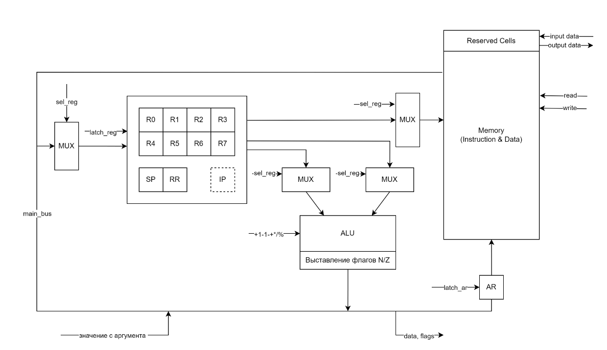
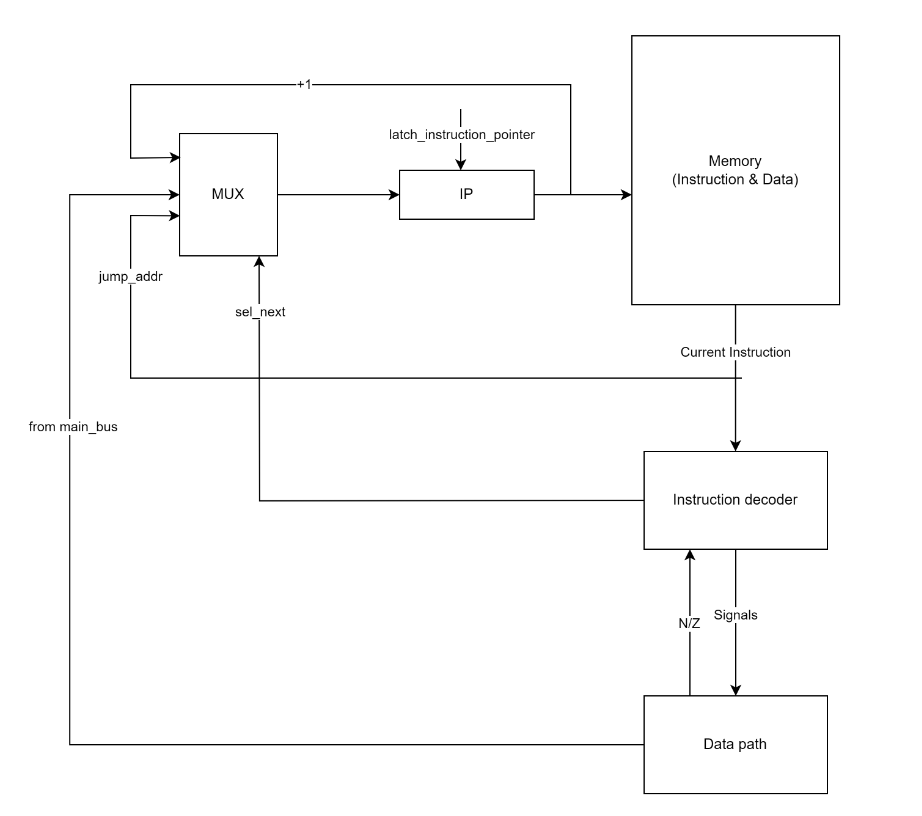

# processor-model

- Рыков Степан Олегович | P3230
- asm | risc | neum | hw | instr | struct | stream | mem | cstr | prob2
- С упрощением

## Язык программирования - Assembly

Синтаксис в расширенной БНФ.

- [ ... ] -- вхождение 0 или 1 раз
- { ... } -- повторение 0 или несколько раз
- { ... }- -- повторение 1 или несколько раз

```copy
program ::= { section }

section ::= data_section | text_section

data_section ::= "section .data:" "\n" { data_line }
text_section ::= "section .text:" "\n" { text_line }

data_line ::= label_name ":" data_value "\n"

data_value ::= integer
             | string
             | label_name
             | buffer

buffer ::= "bf" integer

text_line ::= label [ comment ] "\n"
            | instr [ comment ] "\n"
            | [ comment ] "\n"

label ::= label_name ":"

instr ::= op0
        | op1 register, (register | address)
        | op2 register, register, register
        | op3 (label_name | register)
        | op4 register
        | op5 register, register
        | op6 register, integer

op0 ::= "halt"
      | "ret"

op1 ::= "store"
      | "ld"

op2 ::= "add"
      | "sub"
      | "mul"
      | "div"
      | "mod"

op3 ::= "jmp"
      | "jz"
      | "jnz"
      | "jn"
      | "jnn"
      | "call"

op4 ::= "inc"
      | "dec"
      | "push"
      | "pop"
      | "input"
      | "output"

op5 ::= "cmp"
      | "mov"

op6 ::= "li"

register ::= "r" { <any of "0-9"> }-

integer ::= [ "-" ] { <any of "0-9"> }-

address ::= { <any of "0-9"> }

label_name ::= <any of "a-zA-Z_"> { <any of "a-zA-Z0-9_"> }

string ::= "\"" { <any of "a-zA-Z0-9_ "> } "\""

comment ::= ";" { <any symbol except "\n"> }

```

**Операции**\
Арифметические операции:

`add` - сложить значения двух регистров и записать результат в левый\
`sub` - вычесть значение правого регистра и записать результат в левый\
`mul` - умножить значения двух регистров и записать результат в левый\
`div` - разделить значение левого регистра на значение правого и записать результат в левый\
`mod` - записать в левый регистр остаток от деления значения левого регистра на значение правого\
`inc` - увеличить значение на левом входе АЛУ на 1\
`dec` - уменьшить значение не левом входе АЛУ на 1

Операции с памятью:

`store` - сохранить значение регистра в память (абсолютная адресация)\
`ld`- загрузить в регистр значение из памяти (абсолютная адресация)\
`li` - прямая загрузка значения в регистр

Инструкции перехода:

`jmp` - безусловный переход\
`jz` - переход, если флаг Z = 1\
`jnz` - переход, если флаг Z = 0\
`jn` - переход, если флаг N = 0\
`jnn` - переход, если флаг N = 0

Операции, использующие стек:

`push` - уменьшить SP на 1, записать значение регистра по адресу в SP\
`pop` - загрузить значение в регистр по адресу в SP, увеличить SP на 1\
`call` - вызов подпрограммы: сохранить значение IP на стек, выполнить переход по указанному адресу\
`ret` - возврат из подпрограммы: загрузить значение по SP в IP

IO:

`input` - чтение memory-mapped порта ввода\
`output` - запись в memory-mapped порт вывода

Другие инструкции:

`cmp` - вычесть правый регистр из левого, установить флаги N/Z \
`mov` - копировать значение правого регистра в левый\
`halt` - останов

**Метки**\
Метки для переходов определяются на отдельных строчках и всегда начинаются с символа `.`:

```asm
.label:
    inc
```

И в другом месте (неважно, до или после определения) сослаться на эту метку:

```asm
jmp .label   ; --> `jmp 123`, где 123 - номер инструкции после объявления метки
```

На этапе трансляции вместо метки ставится адрес команды, идущей на следующей строке после метки.
В программе не может быть дублирующихся меток, определенных в разных местах с одним именем.

## Организация памяти

Модель памяти процессора:

- Память команд и данных совмещены (модель фон Неймана)
- Размер машинного слова - 4 байта
- Адресация абсолютная
- Ячейка `0` содержит команду безусловного перехода на метку `.start`
- Ячейки `1` и `2` соответствуют `memory-mapped портам ввода-вывода`'
- С ячейки `3` начинается секция `.data` для переменных. Каждая переменная реализуется списком значений. Типы переменных:
  - **Целочисленные** - отводится одна ячейка памяти `int_var: 2346`
  - **Строковые** - отводится `n + 1` последовательных ячеек памяти, последним символом является 0-терминатор `str_name: 'Some text'`
  - **Ссылочные** - отводится одна ячейка для хранения адреса переменной, на которую она ссылается `link_name: var_name`
  - **Буферные** - отводится `n` последовательных ячеек памяти входе запроса в виде `var_name: bf n`
- Для реализации подпрограмм используется указатель стека `SP`, который изначально хранит последний адрес памяти
- Инструкции `st` и `ld` в качестве второго аргумента могут принимать как регистр (тогда его значение будет загружаться в регистр адресов `AR`), так и число в качестве адреса. Прямое обращение к части с памятью команд не защищено - ответственность программиста
- Инструкция `li` предназначена только для прямой загрузки в регистр

```copy
           memory
+----------------------------+
| 00 : jump .start           |
| 01 : input port            |
| 02 : output port           |
| 03 :      ...              | 
|    part for variables      |
|           ...              |
| n  : program start         |
|           ...              |
+----------------------------+

```

## Система команд

### Особенности процессора

- Машинное слово - 4 байта, знаковое. Операции с памятью осуществляются только при помощи абсолютной адресации.

- Специальные регистры: `SP` - указатель стека (изначально содержит последний адрес памяти), `IP` - счетчик инструкций, `AR` - регистр адресов для работы с памятью, `RR` - используется для временного хранения адреса возврата из подпрограммы.

- Регистры общего назначения: `R0`, `R1`, ... , `R7`.

- Каждый регистр выходит как на левый вход, так и на правый вход АЛУ. На выходе из АЛУ значение может быть записано в любой регистр.

- Загрузка и сохранение данных регистров реализованы на отдельных шинах.

- Поток управления:
  - инкремент `IP` после каждой инструкции
  - переходы на инструкции осуществляются инструкциями перехода и командой `call`

### Набор инструкций

| Инструкция| Кол-во тактов      |
|-----------|--------------------|
| add       | 2                  |
| sub       | 2                  |
| mul       | 2                  |
| div       | 2                  |
| mod       | 2                  |
| inc       | 2                  |
| dec       | 2                  |
| store     | 2                  |
| ld        | 2                  |
| li        | 1                  |
| jmp       | 1 (2, если аргумент - регистр)|
| jz        | 1                  |
| jnz       | 1                  |
| jn        | 1                  |
| jnn       | 1                  |
| push      | 3                  |
| pop       | 3                  |
| call      | 4                  |
| ret       | 6                  |
| input     | 2                  |
| output    | 2                  |
| cmp       | 1                  |
| mov       | 2                  |
| halt      | 0                  |

В таблице приведено количество тактов на цикл исполнения инструкции. Цикл выборки инструкции занимает 2 такта.

### Кодирование инструкций

- Машинный код сериализуется в список JSON
- Один элемент списка - одна инструкция
- Индекс списка - адрес инструкции. Используется для команд перехода
- Первые три аргумента представляют собой регистры
- Четвертый аргумент используется для адресов и значений

**Структура хранения команд и переменных:**

- В случае команд в `"name"` хранится Opcode инструкции, в случае данных - имя переменной/буфера/ссылки

- Значение данных хранится как один целочисленный элемент списка `"args": [data]` в интервале $[-2^{31}, 2^{31}-1]$

```JSON
[
      {
            "index": "addr",
            "name": "command | var_name",
            "args": [
                  "reg", "reg", "reg", "reg | addr | int"
            ]
      }
]
```

## Транслятор

Интерфейс командной строки `make translate_<algorithm_name>` или `make translate_all`

Реализовано в модуле [translator](./translator.py)

Этапы трансляции (функция `translate`):

1. Анализ секции `.data`: создается словарь с переменными `variables`.
      - Для трансляции ссылочных переменных на первом этапе создается словарь `reference_variables`, после чего на втором этапе значения ссылочных переменных подставляются в нужные места в словаре `variables`.
2. Трансляция переменных: добавляются в список `code`, ссылочным переменным подставляются значения.
3. Первый проход секции `.text`: команды добавляются в `code`.
      - Добавление всегда начинается с зарезервированной метки `.start`.
4. Второй проход секции `.text`: подставляются значения меток.

До вызова функции `translate` исходный код очищается от лишних пробельных символов, пустых строк и комментариев.

Правила генерации машинного кода:

Команды `call`, `ret`, `push` и `pop` транслируются в машинный код специальным оразом (остальные транслируются однозначно):

- `call .subroutine` ->

```copy
  1. dec sp
  2. st ip, sp
  3. jmp .subroutine
```

- `ret` ->

```copy
  1. ld rr, sp
  2. inc sp
  3. inc rr
  4. inc rr
  5. jmp rr
```

- `push r0` ->

```copy
  1. dec sp
  2. st r0, sp
```

- `pop r0` ->

```copy
  1. ld r0, sp
  2. inc sp
```

## Модель процессора

Интерфейс исходной строки: `make run_<algorithm_name>` или `make run_all`

Реализовано в модуле: [machine](./machine.py).

## DataPath



Реализован в классе `DataPath`.

Основная часть передачи данных происходит посредством шины `main_bus`:

- в нее считывается значение из памяти;
- в нее загружается прямое значение из аргумента команды `li`;
- в нее проходит значение из выхода АЛУ;
- из нее значение попадает ко всем регистрам;
- из нее передаются флаги состояния.

Сигналы (обрабатываются за один такт, реализованы в виде методов класса):

- `signal_latch_ar` - защелкнуть выбранное значение в регистр адресов `AR`;
- `signal_latch_register` - защелкнуть значение из `main_bus` в выбранный регистр (общего назначения, `SP` или `RR`);
- `sel_register` - выбрать, значение какого регистра положить на шину (левого или правого значения АЛУ, либо для записи в память) или в какой регистр записать значение с `main_bus`;
- `signal_read_memory` - прочитать значение из памяти по выбранному адресу на `main_bus`;
- `signal_write_memory` - записать значение выбранного регистра в память по адресу из `AR`.

Флаги:

- `Z` - отражает наличие нулевого значения на выходе АЛУ;
- `N` - отражает наличие отрицательного значения на выходе АЛУ.

Регистр `IP` в `DataPath` продемонстрирован для удобства, так как с ним используется команда `store` для его сохранения.

## ControlUnit



Реализовано в классе `ControlUnit`.

- Метод `decode_and_execute_instruction` моделирует выполнение полного цикла инструкции (1-2 такта процессора).

Сигнал:

- `latch_instruction_pointer` - защелкнуть значение в `IP`:
  1. IP + 1 - следующая инструкция в памяти
  2. Прямое значение адреса из аргумента команды перехода
  3. Значение регистра из аргумента команды перехода

Особенности работы модели:

- Цикл симуляции осуществляется в функции `simulation`;
- Шаг моделирования соответствует одной инструкции с выводом состояния в журнал.
- Для журнала состояний процессора используется стандартный модуль `logging`.
- Количество инструкций для моделирования ограничено;
- Остановка моделирования осуществляется при:
  - превышении лимита количества выполняемых инструкций;
  - исключении `StopIteration` -- если выполнена инструкция `halt`.

## Тестирование

Тестирование выполняется при помощи golden test-ов.

Реализованы в [golden_test.py](./golden_test.py). Конфигурации хранятся в директории `golden`: [golden/cat.yml](./golden/cat.yml).

Обновить конфигурацию golden tests: `make test-update-golden`.

CI при помощи Github Actions:

```yml
name: Python CI

on:
  push:
    branches:
      - main

jobs:
  test:
    runs-on: ubuntu-latest

    steps:
      - name: Checkout code
        uses: actions/checkout@v4

      - name: Set up Python
        uses: actions/setup-python@v4
        with:
          python-version: 3.11

      - name: Install dependencies
        run: |
          python -m pip install --upgrade pip
          pip install poetry
          poetry install

      - name: Run tests and collect coverage
        run: |
          poetry run coverage run -m pytest .
          poetry run coverage report -m
        env:
          CI: true

  lint:
    runs-on: ubuntu-latest

    steps:
      - name: Checkout code
        uses: actions/checkout@v4

      - name: Set up Python
        uses: actions/setup-python@v4
        with:
          python-version: 3.11

      - name: Install dependencies
        run: |
          python -m pip install --upgrade pip
          pip install poetry
          poetry install

      - name: Check code formatting with Ruff
        run: poetry run ruff format --check .

      - name: Run Ruff linters
        run: poetry run ruff check .
```

где:

- `poetry` -- управления зависимостями для языка программирования Python.
- `coverage` -- формирование отчёта об уровне покрытия исходного кода.
- `pytest` -- утилита для запуска тестов.
- `ruff` -- утилита для форматирования и проверки стиля кодирования.

Пример использования и журнал работы процессора на примере `cat`:

```copy
$ cat input_files/cat_input
Cat program
$ cat algorithms/cat.asm
section .data:
section .text:
    .start:
        li r1, 0    ; 0-terminator
    .loop:
        input r0
        cmp r0, r1
        jz .end
        output r0
        jmp .loop
    .end:
        halt
$ make translate_cat
python ./translator.py ./algorithms/cat.asm ./codes/cat_code.json
source LoC: 12 code instr: 8
$ cat codes/cat_code.json
[{"index": 0, "name": "jmp", "args": [null, null, null, "3"]},
 {"index": 1, "name": "input_port", "args": [0]},
 {"index": 2, "name": "output_port", "args": [0]},
 {"index": 3, "name": "li", "args": ["r1", null, null, "0"]},
 {"index": 4, "name": "input", "args": ["r0", null, null, null]},
 {"index": 5, "name": "cmp", "args": ["r0", "r1", null, null]},
 {"index": 6, "name": "jz", "args": [null, null, null, "9"]},
 {"index": 7, "name": "output", "args": ["r0", null, null, null]},
 {"index": 8, "name": "jmp", "args": [null, null, null, "4"]},
 {"index": 9, "name": "halt", "args": [null, null, null, null]}]
$ make run_cat
python ./machine.py ./codes/cat_code.json ./input_files/cat_input
DEBUG:root:TICK:    0 IP:   0 AR:    0 SP: 2047 RR   0 GPR: [0, 0, 0, 0, 0, 0, 0, 0] FLAGS: Z=0 N=0 MEM_OUT: None       jmp    3
DEBUG:root:TICK:    2 IP:   3 AR:    0 SP: 2047 RR   0 GPR: [0, 0, 0, 0, 0, 0, 0, 0] FLAGS: Z=0 N=0 MEM_OUT: None       li     r1 0
DEBUG:root:TICK:    5 IP:   4 AR:    0 SP: 2047 RR   0 GPR: [0, 0, 0, 0, 0, 0, 0, 0] FLAGS: Z=0 N=0 MEM_OUT: None       input  r0
DEBUG:root:input: 'C'
DEBUG:root:TICK:    9 IP:   5 AR:    1 SP: 2047 RR   0 GPR: [67, 0, 0, 0, 0, 0, 0, 0] FLAGS: Z=0 N=0 MEM_OUT: 67        cmp    r0 r1
DEBUG:root:TICK:   12 IP:   6 AR:    1 SP: 2047 RR   0 GPR: [67, 0, 0, 0, 0, 0, 0, 0] FLAGS: Z=0 N=0 MEM_OUT: 67        jz     9
DEBUG:root:TICK:   14 IP:   7 AR:    1 SP: 2047 RR   0 GPR: [67, 0, 0, 0, 0, 0, 0, 0] FLAGS: Z=0 N=0 MEM_OUT: 67        output r0
DEBUG:root:output: 'C' << 'C'
DEBUG:root:TICK:   18 IP:   8 AR:    2 SP: 2047 RR   0 GPR: [67, 0, 0, 0, 0, 0, 0, 0] FLAGS: Z=0 N=0 MEM_OUT: 67        jmp    4
DEBUG:root:TICK:   20 IP:   4 AR:    2 SP: 2047 RR   0 GPR: [67, 0, 0, 0, 0, 0, 0, 0] FLAGS: Z=0 N=0 MEM_OUT: 67        input  r0
DEBUG:root:input: 'a'
DEBUG:root:TICK:   24 IP:   5 AR:    1 SP: 2047 RR   0 GPR: [97, 0, 0, 0, 0, 0, 0, 0] FLAGS: Z=0 N=0 MEM_OUT: 97        cmp    r0 r1
DEBUG:root:TICK:   27 IP:   6 AR:    1 SP: 2047 RR   0 GPR: [97, 0, 0, 0, 0, 0, 0, 0] FLAGS: Z=0 N=0 MEM_OUT: 97        jz     9
DEBUG:root:TICK:   29 IP:   7 AR:    1 SP: 2047 RR   0 GPR: [97, 0, 0, 0, 0, 0, 0, 0] FLAGS: Z=0 N=0 MEM_OUT: 97        output r0
DEBUG:root:output: 'Ca' << 'a'
DEBUG:root:TICK:   33 IP:   8 AR:    2 SP: 2047 RR   0 GPR: [97, 0, 0, 0, 0, 0, 0, 0] FLAGS: Z=0 N=0 MEM_OUT: 97        jmp    4
DEBUG:root:TICK:   35 IP:   4 AR:    2 SP: 2047 RR   0 GPR: [97, 0, 0, 0, 0, 0, 0, 0] FLAGS: Z=0 N=0 MEM_OUT: 97        input  r0
DEBUG:root:input: 't'
DEBUG:root:TICK:   39 IP:   5 AR:    1 SP: 2047 RR   0 GPR: [116, 0, 0, 0, 0, 0, 0, 0] FLAGS: Z=0 N=0 MEM_OUT: 116      cmp    r0 r1
DEBUG:root:TICK:   42 IP:   6 AR:    1 SP: 2047 RR   0 GPR: [116, 0, 0, 0, 0, 0, 0, 0] FLAGS: Z=0 N=0 MEM_OUT: 116      jz     9
DEBUG:root:TICK:   44 IP:   7 AR:    1 SP: 2047 RR   0 GPR: [116, 0, 0, 0, 0, 0, 0, 0] FLAGS: Z=0 N=0 MEM_OUT: 116      output r0
DEBUG:root:output: 'Cat' << 't'
DEBUG:root:TICK:   48 IP:   8 AR:    2 SP: 2047 RR   0 GPR: [116, 0, 0, 0, 0, 0, 0, 0] FLAGS: Z=0 N=0 MEM_OUT: 116      jmp    4
DEBUG:root:TICK:   50 IP:   4 AR:    2 SP: 2047 RR   0 GPR: [116, 0, 0, 0, 0, 0, 0, 0] FLAGS: Z=0 N=0 MEM_OUT: 116      input  r0
DEBUG:root:input: '\n'
DEBUG:root:TICK:   54 IP:   5 AR:    1 SP: 2047 RR   0 GPR: [10, 0, 0, 0, 0, 0, 0, 0] FLAGS: Z=0 N=0 MEM_OUT: 10        cmp    r0 r1
DEBUG:root:TICK:   57 IP:   6 AR:    1 SP: 2047 RR   0 GPR: [10, 0, 0, 0, 0, 0, 0, 0] FLAGS: Z=0 N=0 MEM_OUT: 10        jz     9
DEBUG:root:TICK:   59 IP:   7 AR:    1 SP: 2047 RR   0 GPR: [10, 0, 0, 0, 0, 0, 0, 0] FLAGS: Z=0 N=0 MEM_OUT: 10        output r0
DEBUG:root:output: 'Cat\n' << '\n'
DEBUG:root:TICK:   63 IP:   8 AR:    2 SP: 2047 RR   0 GPR: [10, 0, 0, 0, 0, 0, 0, 0] FLAGS: Z=0 N=0 MEM_OUT: 10        jmp    4
DEBUG:root:TICK:   65 IP:   4 AR:    2 SP: 2047 RR   0 GPR: [10, 0, 0, 0, 0, 0, 0, 0] FLAGS: Z=0 N=0 MEM_OUT: 10        input  r0
DEBUG:root:input: '\x00'
DEBUG:root:TICK:   69 IP:   5 AR:    1 SP: 2047 RR   0 GPR: [0, 0, 0, 0, 0, 0, 0, 0] FLAGS: Z=0 N=0 MEM_OUT: 0  cmp    r0 r1
DEBUG:root:TICK:   72 IP:   6 AR:    1 SP: 2047 RR   0 GPR: [0, 0, 0, 0, 0, 0, 0, 0] FLAGS: Z=1 N=0 MEM_OUT: 0  jz     9
DEBUG:root:TICK:   74 IP:   9 AR:    1 SP: 2047 RR   0 GPR: [0, 0, 0, 0, 0, 0, 0, 0] FLAGS: Z=1 N=0 MEM_OUT: 0  halt
INFO:root:output_buffer: 'Cat\n'
Cat

instr_counter: 25 ticks: 75
```

Пример проверки исходного кода:

```copy
$ make test-update-golden
poetry run pytest . -v --update-goldens
===================================================================== test session starts =====================================================================
platform win32 -- Python 3.12.2, pytest-7.4.4, pluggy-1.5.0 -- C:\Users\stepan\AppData\Local\pypoetry\Cache\virtualenvs\processor-model-PLcP2Oiw-py3.12\Scripts\
python.exe
cachedir: .pytest_cache
rootdir: C:\Users\stepan\Desktop\sem4\CA\lab3\processor-model
configfile: pyproject.toml
plugins: golden-0.2.2
collected 4 items                                                                                                                                              

golden_test.py::test_translator_asm_and_machine[golden/cat.yml] PASSED                                                                                   [ 25%]
golden_test.py::test_translator_asm_and_machine[golden/hello.yml] PASSED                                                                                 [ 50%]
golden_test.py::test_translator_asm_and_machine[golden/hello_username.yml] PASSED                                                                        [ 75%]
golden_test.py::test_translator_asm_and_machine[golden/prob2.yml] PASSED                                                                                 [100%]

====================================================================== 4 passed in 1.08s ======================================================================
```

```copy
| ФИО                   | алг              | LoC | code инстр. | инстр. | такт. | вариант |
| Рыков Степан Олегович | cat              | 12  |  8          | 25     | 57    | [asm | risc | neum | hw | instr | struct | stream | mem | cstr | prob2] |
| Рыков Степан Олегович | hello_username   | 46  |  55         | 367    | 1182  | [asm | risc | neum | hw | instr | struct | stream | mem | cstr | prob2] |
| Рыков Степан Олегович | hello            | 16  |  10         | 78     | 246   | [asm | risc | neum | hw | instr | struct | stream | mem | cstr | prob2] |
| Рыков Степан Олегович | prob2            | 53  |  57         | 743    | 2461  | [asm | risc | neum | hw | instr | struct | stream | mem | cstr | prob2] |

```
